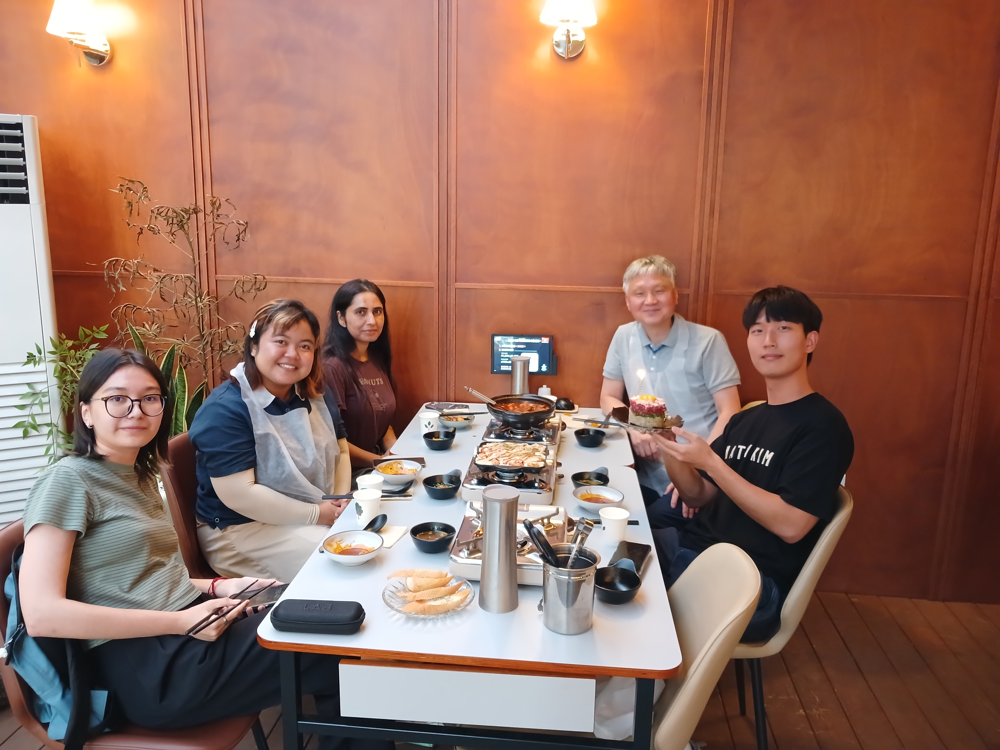

<!--more-->

  

  <button
    class="farewell-button farewell-prev"
    type="button"
    onclick="changeFarewellImage(-1)"
    aria-label="Previous image">
    &#10094;
  </button>

  <button
    class="farewell-button farewell-next"
    type="button"
    onclick="changeFarewellImage(1)"
    aria-label="Next image">
    &#10095;
  </button>

  

    1 / 2
  

